**Jimmy Ba**

1)[Layer Normalization](https://arxiv.org/abs/1607.06450) 

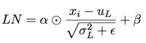

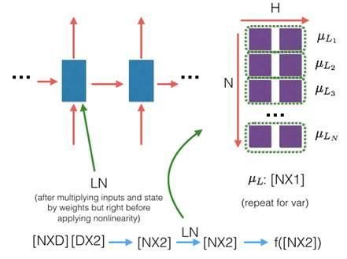

Batch Norm:
+ Stable if the batch size is large
+ Robust (in train) to the scale & shift of input data
+ Robust to the scale of weight vector
+ Scale of update decreases while training
- Not good for online learning
- Not good for RNN, LSTM
- Different calculation between train and test

Weight Norm:
+ Smaller calculation cost on CNN
+ Well-considered about weight initialization
+ Implementation is easy
+ Robust to the scale of weight vector
- Compared with the others, might be unstable on train?
- High dependence to input data

**Layer Norm:**
+ Effective to small mini batch RNN
+ Robust to the scale of input
+ Robust to the scale and shift of weight matrix
+ Scale of update decreases while training
- Might be not good at CNN?

**Layer normalization** (Ba 2016): Does not use batch statistics. Normalize using the statistics collected from all units within a layer of the current sample. Does not work well with ConvNets.

**Recurrent Batch Normalization (BN)** (Cooijmans, 2016; also proposed concurrently by [https://arxiv.org/abs/1604.03640](https://arxiv.org/abs/1604.03640), but tested on Recurrent ConvNets, instead of RNN/LSTM): Same as batch normalization. Use different normalization statistics for each time step. You need to store a set of mean and standard deviation for each time step.

**Batch Normalized Recurrent Neural Networks** (Laurent, 2015): batch normalization is only applied between the input and hidden state, but not between hidden states. i.e., normalization is not applied over time.

**Streaming Normalization** (Liao et al. 2016) : it summarizes existing normalizations and overcomes most issues mentioned above. It works well with ConvNets, recurrent learning and online learning (i.e., small mini-batch or one sample at a time): [https://arxiv.org/abs/1610.06160](https://arxiv.org/abs/1610.06160)

**Weight Normalization** (Salimans and Kingma 2016): whenever a weight is used, it is divided by its L2 norm first, such that the resulting weight has L2 norm 1. That is, output y = x*(w/|w|), where x and w denote the input and weight respectively. A scalar scaling factor g is then multiplied to the output y = y*g. But in my experience g seems not essential for performance (also downstream learnable layers can learn this anyway). One can take derivative w.r.t. this division process to compute the gradient of the original "unnormalized" gradient such that it can be learned.

**Cosine Normalization** (Luo et al. 2017): weight normalization is very similar to cosine normalization, where the same L2 normalization is applied to both weight and input: y = (x/|x|)*(w/|w|). Again, manual or automatic differentiation can compute appropriate gradients of x and w.

Note that both Weight and Cosine Normalization have been extensively used in 2000s in a class of ConvNets called HMAX (Riesenhuber 1999) to model biological vision. 

2)[Show Attend & Tell: Neural Image Caption Generation with Visual Attention](https://www.google.com/url?sa=t&rct=j&q=&esrc=s&source=web&cd=1&ved=0ahUKEwj_98Pzye_UAhVEFz4KHQvkAqkQFggpMAA&url=https%3A%2F%2Farxiv.org%2Fabs%2F1502.03044&usg=AFQjCNHNxToFTaLfd7wafHf1QSkCpfX6yw&cad=rja)

* Previous approaches:

    * Object detection w/ attribute discovery

    * Or, Modify based on similar captioned image from database

* Encoder: Lower convolution layer of CNN captures spatial information

    * Extract correspondence of feature vectors ←→portion of 2D image helps interpret what model sees 

* Decoder: LSTM which generates a caption word by word

* Using CNN, extract Annotation vector for each part of image, weighted by attention mechanism

* Attention mechanism:

    * a "soft" deterministic attention mechanism trained back-propagation

    * a "hard" stochastic attention mechanism trained maximizing an approximate variational lower bound (marginal log-likelihood log(p(y|a) of observing word sequence y given image features a.

        * doubly stochastic regularization attention does not strictly sum to 1, allows some "divided" attention

    * adaptive learning rates w/ RMSProp or Adam algorithm 

* Evaluation: used BLEU & METEOR

    * 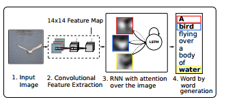

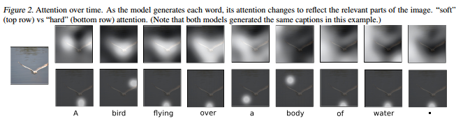

3)

#################################################################

**Mark Ebden**

1)[Overlapping Community Detection using Bayesian Nonnegative Matrix Factorization](http://www.robots.ox.ac.uk/~sjrob/Pubs/PRE_NMF.pdf)

* Previously approach: view community as unions of adjacent k-cliques (Clique Percolation Method)

* We instead, assign links, not nodes. Node has multiple groups by its links. Communities grouped by similar nodes.

* Transformed from modularity optimization into a nonlinear constrained optimization problem solves resolution limit of small communities

* V = Adjacency matrix, W and H are the approximate non-negative factorization, **β** is set scale hyperparameters on latent variables w.*ik* , h.*kj*

    * Assume interaction pairs in V are generated by a Poisson distribution

* Try discover latent variables that would explain increased interaction density, and thus likely to belong in the same community

* Posterior based cost function; 

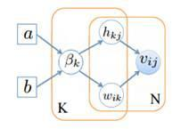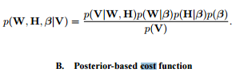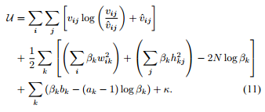

* # of communities = # of non-zero columns of W and H

* Assume no inter-dependency btw/ communities, existence of community doesn’t depend on others

2) [Multi-Agent Simulation for Prediction and Scheduling of Aero Engine Overhaul](http://www.robots.ox.ac.uk/~parg/pubs/AAMAS_2008.pdf)  (OPS simulator)

**Side-note: On the abstract level, is there value to treat the agents in this model as different market participants, or anticipating maturing bonds? Look forward to hear your thoughts.**

OPS Capabilities:

* Whole engine reliability is determined by combining individual component distributions, approx. by **Weibull functio**n, with disruption types in 1)risk decrease significantly after initial period 2)constant random 3)depreciation

* Dynamically update reliability using environmental & operational factors

* Need to balancing maximum engine utilization, cost of expiring past removal date, and acceptable reliability, and unforeseen schedule changes/conflict

* What-if scenario analysis

* Use "contingency buffer" and adaptive re-negotiation mechanism, new repair schedules can be created “on-the-fly” without significant cascading impact

* Evaluate "quality" in the future by comparing the “market-based mechanism” as benchmark

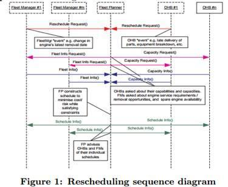  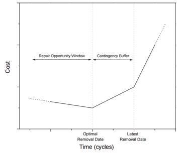

##########################################################################

**Adam Kolkiewicz**

Research interests: 

Statistics: time series analysis, robust methods of estimation, and asymptotic methods of inference

Financial mathematics: 

* Valuation and hedging problems in the context of incomplete markets. 

    * Realistic models of asset prices, such as stochastic volatility models, or in insurance contracts that are linked to equity markets and provide some form of protection.

    * Developed a framework to model jointly the market risk and the risk of the early withdrawal of a policyholder.

* high-dimensional problems that use the dynamic programming approach

* Pricing of American options, hedging, and dynamic selection of a portfolio. 

[Pricing american derivatives using simulation a low biased approach](https://uwaterloo.ca/waterloo-research-institute-in-insurance-securities-and-quantitative-finance/sites/ca.waterloo-research-institute-in-insurance-securities-and-quantitative-finance/files/uploads/files/01-09.pdf) – Reading

[An improved simulation method for pricing high-dimensional American derivatives](https://ai2-s2-pdfs.s3.amazonaws.com/9d03/d49490d960ced9241e274ab108b5ec64fd29.pdf) – still reading

* Pricing high-dimensional options has challenges

    * Early exercise of these contracts

    * Monte-Carlo method is slow and not good for high dimensional problems

    * Stochastic mesh method may converge slowly and need complex variance reduction techniques

    * Quasi-Monte Carlo w/ certain mesh density method is only good for 1~2 asset combination

        * The key to the stochastic mesh method and the low discrepancy mesh (LDM) method is the observation that points that we generate to calculate one conditional expectation can also be used to calculate other expectations

* Propose: new estimator combined with quasi-Monte Carlo, borrowing concept of dynamic programming

2)[Bayesian Analysis of Asymmetric Stochastic Conditional Duration Model](http://www.rcfea.org/RePEc/pdf/wp28_13.pdf)

* Previously: ARCH & GARCH model fail because requires time series data be regularly spaced

* Stochastic conditional duration (SCD) models conditional duration as latent variables, to capture random flow of information in financial markets

    * Previous extension1: est. parameters via quasi-maximum likelihood with a Kalman filter

    * Previous extension2: use Monte Carlo maximum likelihood (MCML) to allow for correlation between transformed equation and the latent process

* We extend without logarithmic transformation on the observation equations, in order to remove/relax the distributional assumptions about correlation between error processes or innovations of observed duration process and latent log duration process

* Use auxiliary particle filtering technique to get one-step-ahead in-sample and out-of-sample duration forecasts

* Assess fit and "accuracy" of ASCD model through:

    * KS test: whether realized observation errors originated from the assumed distribution

    * analyze the Probability Integral Transforms (PITs) 

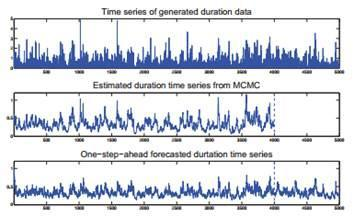

#######################################################################

Mu Zhu

[Content-boosted Matrix Factorization Techniques for Recommender Systems](https://arxiv.org/pdf/1210.5631.pdf) (2013)

* Recommender systems has 2 classes 

1) content-based

2) Collaborative filtering (CF) – users who have rated the same items closely may have similar preferences overall

    * Nearest neighbors

    * Matrix factorization –has a "cold start" problem because don’t have information for new users (U) or new item(I)

        * Normalize ratings, remove noise with ANOVA, then apply matrix factorization

        * Alternative gradient descent, because both latent feature vector for both users and items are not known, optimization is non-convex

        * Shrink latent vector of each item toward centroids of items that share some attributes

        * Regression constraints – force items w very similar content attributes mapped to same vector, using their attributes’ latent feature vec

        * Incorporate user created tag attribute feedback

        * Pro: More interpretable results, retrieving important latent attributes

        * Future Research : Fill missing entries of matrix while keeping the rank low; yet considered Generative models

* Main lesson learned from Netflix contest:

    * Need to develop diverse models that capture distinct effects, even if small effects; combining models is good (800+ models) @.@

[Feature Extraction for Nonparametric Discriminant Analysis](https://web.stanford.edu/~hastie/Papers/dimensionReduction.pdf) – (2003)

* LDA does not guarantee finding the best features (discriminant directions) because class centroids can coincide

* The idea overall echoes the book chapter from Hastie’s book.

His other research publications mostly focused on health rehabilitation plan, protein chain folding, and [continuous time stochastic block model for basketball networks](https://arxiv.org/pdf/1507.01816.pdf)

######################################################################

Olga Vechtomova

Research Interests:

* Information Retrieval, Natural Language Processing and Computational Linguistics. 

* Entity retrieval, identification of semantic relations between entities in text, targeted opinion retrieval, interactive and automatic query expansion, the use of multi-word units and word co-occurrences in information retrieval. 

* Wrote a book review on Introduction to Information Retrieval by Christopher Manning

[Optimizing Nugget Annotations with Active Learning](https://cs.uwaterloo.ca/~h435zhan/CIKM2016.pdf)

* TREC Q&A and Temporal Summarization tasks need to know if certain relevant info/answer key/(nuggets) is in a text. 

* View this nugget annotation task as high-recall retrieval problem using active learning techniques. 

* Techniques: 1)Most Likely Candidate – most likely nugget match to this sentence, train a classifier for each nugget. 

        2)Cover Maximum Candidate- picks sentence with most nuggets contained.

                

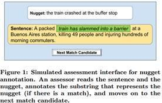

[Novelty and Diversity in Information Retrieval Evaluations](https://pdfs.semanticscholar.org/1500/4aadabd967ac722a28a9c3bb39cf5bc32605.pdf)  **--Top cited work (279)**

* Given an ambiguous question, display result documents for each of the ambiguous meaning of the query by excluding similar duplicate ones (within the same subtopics). 

* View these questions as all the subtopic examples of the target "NCL". 

* Relevancy judged by whether a doc contains a "nugget". 

* Need to account for the ambiguity score (a mixture of topics?) of the query when rewarding diversity in answers

**Thoughts:**** train a classifier for each nugget. Training data setup to generalize to other data types? Too much supervisions?**

Title: [A semi-supervised approach to extracting multiword entity names from user reviews](https://km.aifb.kit.edu/ws/jiwes2012/slides/JIWES2012-vechtomova.pdf)

Idea: Extract dish names from online reviews. Start with some seed words, e.g. "pizza", and then find others by ranking all single & multiword units by distributional similarity. 

* Context feature vectors = grammatical dependency triples it co-occurs with. E.g. "eat V:obj:N pizza", “very good pizza”. 

* Build vector feature for each triple by replacing seed word with X.   "eat V:obj:N   **X**"

* For each feature in the vector of a seed or candidate word, record TF, which is the frequency of co-occurrence of the feature with this word in the corpus. 

* TF of the feature "eat VB:dobj:NN X" in the vector of the word “pasta” is the frequency of occurrence of “eat VB:dobj:NN pasta” dependency triple in the corpus. 

* Compute similarity by Query Adjusted Combined Weight formula, where seed = query, similar candidate = document

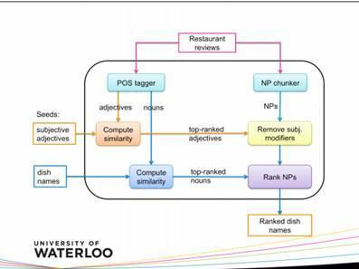  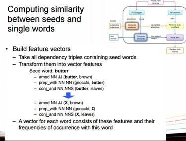

Thoughts: Certain domain specific chat can have some unique "grammars" that don’t fit to the Stanford dependency parser...

**Application: User feedback loop?**

[Elicitation and use of relevance feedback information](http://ov-research.uwaterloo.ca/papers/IPM2004.pdf)

